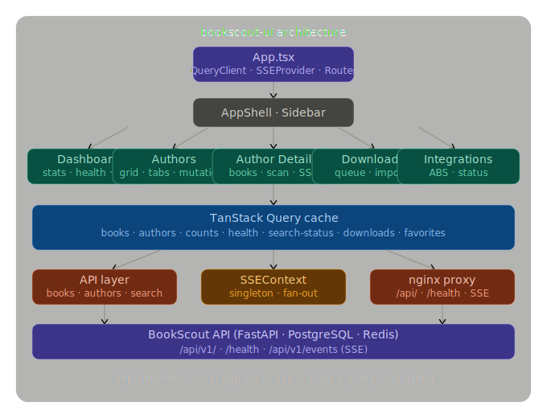

# BookScout UI

A React control panel for [BookScout](https://github.com/slackerchris/bookscout) — track missing audiobooks, manage authors, and monitor scan activity in real time.

> **Optional sidecar** — BookScout runs fine without this UI. It's a convenience front-end that talks to the BookScout `/api/v1` REST + SSE API.

---

## Architecture



---

## Features

- **Dashboard** — compact library stats plus live service health indicators
- **Authors** — All / Watching / Not watching tabs; add authors, trigger scans, view co-authors. **Favorites** (star icon) are only available on *watched* authors — the flag is stored in the watchlist row, so an author must be watched before they can be favorited. Watch an author first, then mark them as a favorite.
- **Author Detail** — per-author bookshelf with filters, server-backed counts, scan actions, and missing/confirmed breakdown
- **Downloads** — audiobook-focused queue view with status counts, compact progress list, and owned-book history
- **Integrations** — live status for BookScout API, downloader, Prowlarr, Jackett, and n8n
- **Activity** — real-time SSE event log (up to 200 events) with a "Scan all authors" button

## Tech Stack

| | |
|---|---|
| React 19 + Vite 8 | SPA, fast HMR |
| TypeScript 5.9 | Strict mode |
| Tailwind v4 | Vite plugin, no config file |
| shadcn/ui | New York style, zinc theme |
| TanStack Query v5 | Data fetching + cache |
| React Router v7 | Client-side routing |
| Server-Sent Events | Singleton connection, fan-out to all subscribers |

---

## Development

```bash
npm install
npm run dev        # starts at http://localhost:5173
```

The Vite dev server proxies `/api` and `/health` to `http://localhost:8765` (BookScout API default port).

## Production Build

```bash
npm run build      # outputs to dist/
npm run preview    # preview the production build locally
```

---

## Docker

### Pull from registry

```bash
docker pull ghcr.io/slackerchris/bookscout-ui:latest
```

### Build locally

```bash
docker build -t bookscout-ui:latest .
```

### Run standalone

```bash
docker run -d \
  --name bookscout-ui \
  -p 8080:80 \
  --network bookscout \
  ghcr.io/slackerchris/bookscout-ui:latest
```

### Add to an existing BookScout compose stack

```yaml
services:
  bookscout-ui:
    image: ghcr.io/slackerchris/bookscout-ui:latest
    container_name: bookscout-ui
    restart: unless-stopped
    ports:
      - "8080:80"
    depends_on:
      - bookscout
    networks:
      - bookscout
```

nginx inside the container proxies `/api/` → `http://bookscout:8765` (the BookScout service on the same Docker network). `proxy_buffering off` is set so SSE live updates work correctly.

---

## API Compatibility

Targets the BookScout `/api/v1` API. Key endpoints used:

| Endpoint | Used by |
|---|---|
| `GET /api/v1/books/` | Author Detail, Downloads history |
| `GET /api/v1/authors/` | Authors page, Dashboard stat card |
| `POST /api/v1/authors/` | Add author |
| `DELETE /api/v1/authors/{id}` | Remove author |
| `GET /api/v1/authors/{id}/coauthors` | Coauthors drawer |
| `POST /api/v1/scans/author/{id}` | Scan author button |
| `POST /api/v1/scans/all` | Scan all (Activity page) |
| `GET /api/v1/search/status` | Integrations page, Dashboard service health |
| `GET /api/v1/search/download/queue` | Downloads queue |
| `GET /api/v1/events` | SSE live updates (singleton connection) |

---

## Environment

No runtime environment variables required. The API base URL is resolved at the nginx proxy layer — ensure the UI container and the BookScout API container share the same Docker network (`bookscout` by default).

---

## Changelog

See [CHANGELOG.md](CHANGELOG.md) for the full history.
